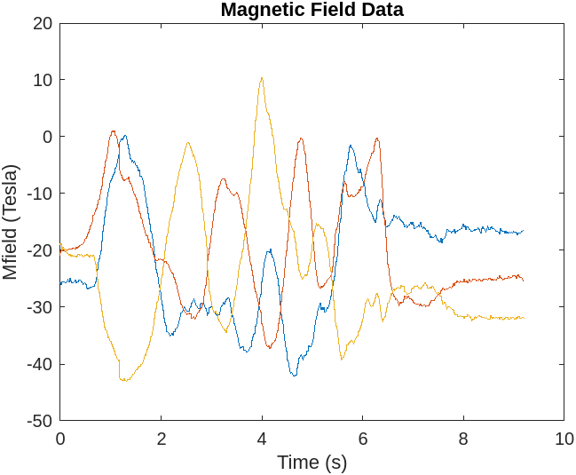

# Mobile Sensor Data Fusion

This project demonstrates how to collect sensor data from a mobile device (such as accelerometer, gyroscope, magnetometer) and fuse it using an Extended Kalman Filter (AHRS) to estimate orientation (roll, pitch, and yaw angles).

## Requirements

- MATLAB
- Mobile device with sensors (accelerometer, gyroscope, magnetometer)
- Mobile device with MATLAB Mobile installed (optional for remote data logging)

## Usage

1. Connect your mobile device to MATLAB or use MATLAB Mobile for remote data logging.
2. Run the provided MATLAB script `MobDeviceSensorFusion.m`.
3. Follow the on-screen instructions to start logging sensor data from your mobile device.
4. Once data collection is complete, the script will automatically process and visualize the sensor fusion results.

## Files

- `MobDeviceSensorFusion.m`: MATLAB script for collecting sensor data and performing sensor fusion.
- `README.md`: This file providing an overview of the project.
- Other MATLAB functions and scripts used in the project.

## Project Structure

- `Data`: Directory containing raw sensor data files.
- `Figures`: Directory containing generated plots and figures.

## Results

The sensor fusion algorithm successfully combines data from different sensors to estimate the orientation of the mobile device. Visualization graphs comparing MATLAB estimation with actual device data are provided in the `Figures` directory.

## Various Sensor Data:

### Acceleration Data :

### AngularvelocityData(GyroScopeData) :

### MagneticFieldData :

### Orientatation Data From the mobile sensors:

## Estimated Orientation Data using Sensor Fusion:

### Pitch:

### Roll:

### Yaw:

## License

This project is licensed under the [MIT License](LICENSE).
